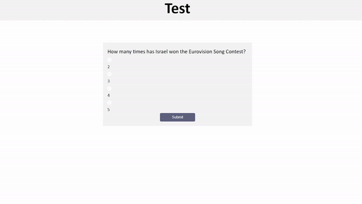
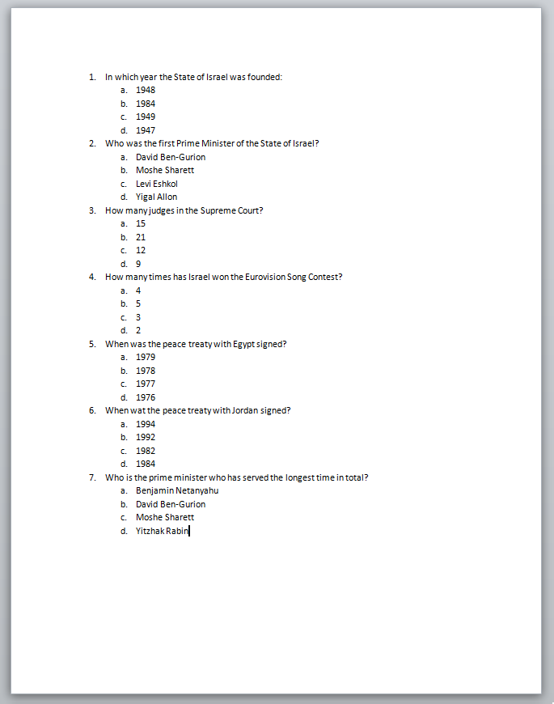

# test-prep
## Introduction
The project is to provide a solution for students studying in Ariel University's heritage courses.
Every student at Ariel University is required to take a number of heritage courses amounting to 12
 credit points as part of the first degree. Most courses contains multiple choice tests.
 
 The project allows students a unique way of learning. Given a file with questions,
  the software builds for the student a test with several questions according to his
   choice and returns a score according to his success.
   


## User Connection
After you download/ clone the repository make sure to change the `Application.properties` file accordingly to your information.

This is how it looks:
```
# Env variables
spring.jpa.hibernate.ddl-auto=update
# DDL Config
my-properties.path= puth you docx path over here
my-properties.numberOfQuestions= choose the number of question in each test
```

You only need to change the second and the third lines.

For Example:
```
# Env variables
spring.jpa.hibernate.ddl-auto=update
# DDL Config
my-properties.path=C:\\Users\\Chen\\Desktop\\test.docx
my-properties.numberOfQuestions=5
```
### Docx parser
In order for the program to work the file should be in a specific form:
* Each question description must be written as X. when X is an integer number.
* Each question contains multiple answers each answer must written as Y. when Y is an english letter, the first answer should be the right answer.
* The file should not include spaces.

For Example:

 